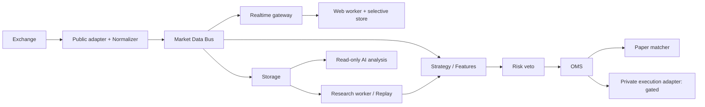

# 架构设计

当前实现说明：Phase 1 已实现 apps/api、apps/web、core 模型/存储与 migrations/infrastructure；下面其他模块均为后续设计，不代表已实现。版本通过锁文件固定，当前 native 应用 + Compose 数据服务已验证。

状态：设计，Not Implemented。参考结论与证据边界见 [RESEARCH](RESEARCH.md)。

## 决策
采用模块化 monorepo，先部署 API、market worker、research worker、web，避免过早拆成微服务。
Python 3.12+ / FastAPI / Pydantic v2 / SQLAlchemy 2 / Alembic / asyncio；Next.js / React / TypeScript / Tailwind / shadcn/ui / Zustand / TanStack Query / Lightweight Charts。版本与 lockfile 在 Phase 1 安装兼容性验证后固定，当前不伪称已验证。
PostgreSQL 为订单、账户和配置真相源，TimescaleDB 用于时间序列，Redis 用于缓存/短期分发，不作为订单账本。初期量化以 NumPy 为基线，Pandas/Polars/Numba 随需求引入；TA-Lib/pandas-ta 单独兼容性评估；ClickHouse 延后至实测容量需要。

## 规划目录
- apps/api：认证、HTTP、WebSocket gateway、任务提交；不得同步跑回测。
- apps/web：终端与设计系统，客户端无交易所凭据。
- apps/worker：行情采集、历史数据与研究任务，分开进程池。
- core/{market_data,exchange,strategy,indicators,backtest,execution,orders,portfolio,risk,analytics,replay,ai,optimization,storage}：有边界的 Python 模块。
- tests/{unit,integration,regression,simulation,performance,recovery,chaos}，docs，infrastructure。
仅规划目录，Phase 0 不创建空壳实现。避免泛化的 shared 模块变成相互依赖入口。

## 边界与一致性
Strategy 与 AI 不导入 exchange/storage/secret 设施；Strategy 输出 Signal，Risk 审批为 OrderIntent，OMS 负责执行。公共和私有适配器能力分开。单个账户由一个执行所有者串行处理订单/风控；通过数据库租约与 fencing token 防止双进程同时下单。
订单意图、RiskDecision、Audit、Outbox 在同一数据库事务持久化；Outbox 重发和消费均幂等。网络发送与数据库无法原子提交，提交结果不明进入 UNKNOWN_SUBMISSION 辅助状态并查询，不自动重下。Redis 故障不能丢失交易账本。
行情按 instrument+channel 分区，bounded queue；ticker 可合并，orderbook delta 不得静默丢弃，溢出置 invalid 并 resync。策略数据流与 UI 节流独立。持久化失败禁止交易，UI 可只读但标记 degraded。

## HTTP / WebSocket 规划合同
HTTP /api/v1：instruments、candles（范围/分页）、system/status、backtests（异步 job）、replay-sessions、paper-orders、portfolio、risk/status、risk/kill-switch。私有资源按 owner/account 授权；mutating 请求需要权限与 idempotency key。Phase 13 前无 live-orders 路由。
错误结构：code/message/request_id/retryable/details；不含密钥。分页限制、速率限制、UTC 范围与 Decimal 字符串由共享 schema 生成 TypeScript 类型。
WS /ws/v1：subscribe/unsubscribe 明确 ack；envelope 包含 schema_version、channel、instrument_id、sequence、event_time、received_at、quality、payload。先 snapshot 后 delta；重连握手返回新 generation，旧 generation 消息丢弃。消费者发现 sequence gap 请求 snapshot，不沿用旧 book。慢客户端有队列上限，断开并要求重新订阅。权限检查发生在握手和订阅，禁止跨账户泄漏。

## 运行规划
Docker Compose 管理 web/api/worker/PostgreSQL(TimescaleDB)/Redis；开发数据库只绑定本机。配置与凭据分离；LIVE_TRADING=false。/health/live 仅表示进程，/health/ready 分别报告数据库、缓存、行情与模式，不把无行情状态报为可交易。云任务已隔离，使用现有 checkout，不额外创建 worktree。
运行命令与可复用环境脚本在 Phase 1 实际测试后保存，当前无可启动应用。
